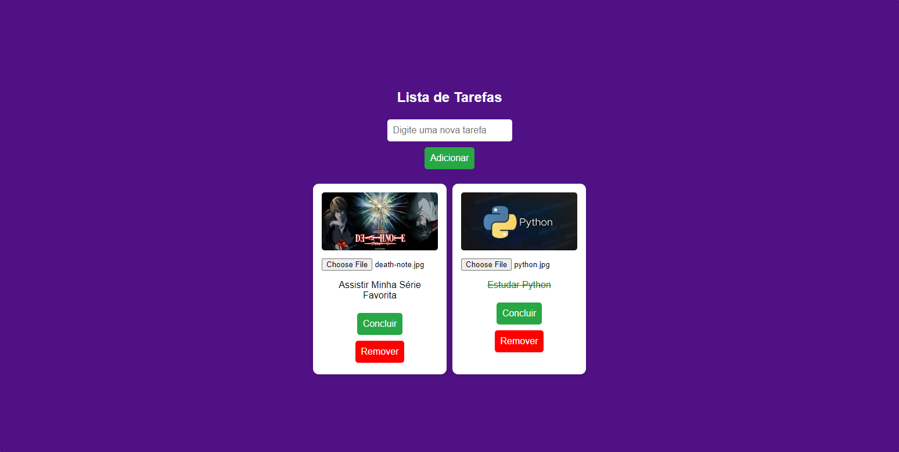

# 📋 ToDo List Animada

Um projeto de Lista de Tarefas interativa com animações, cards responsivos, possibilidade de adicionar imagens personalizadas para cada tarefa e efeitos visuais ao concluir ou remover uma tarefa.
  
*(Imagem de preview do projeto)*

## 🚀 Funcionalidades

- Adicionar tarefas em um layout moderno e responsivo.
- Usuário pode adicionar uma imagem para cada tarefa.
- O botão "Remover" remove a tarefa com uma animação de desaparecimento.
- O usuário pode alterar a imagem do card ao passar o cursor sobre ele.

## 🛠️ Tecnologias Utilizadas

- HTML5
- CSS3 (incluindo animações e efeitos visuais)
- JavaScript (DOM Manipulation)

## 📦 Como instalar e rodar o projeto

1. Clone este repositório:
   ```bash
   git clone https://github.com/mateus-henriquee/ToDo-List.git
   ```

2. Acesse o diretório do projeto:
   ```bash
   cd ToDo-List
   ```

3. Abra o arquivo `index.html` no seu navegador.


## 📌 Melhorias Futuras

- Adicionar suporte para salvar as tarefas no `localStorage`.
- Implementar um botão para editar a descrição da tarefa.
- Criar um tema escuro.

---
🌟 Se você gostou dos meus projetos, não esqueça de dar uma estrela!

Feito com ❤️ por [Mateus Henrique Leccese](https://github.com/mateus-henriquee)

